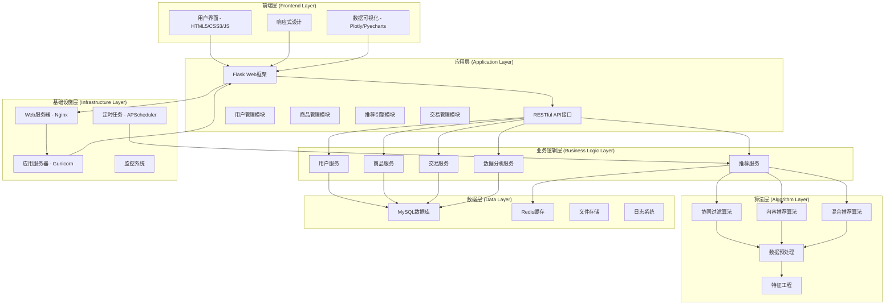
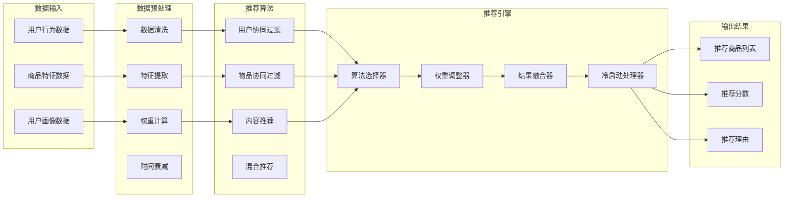
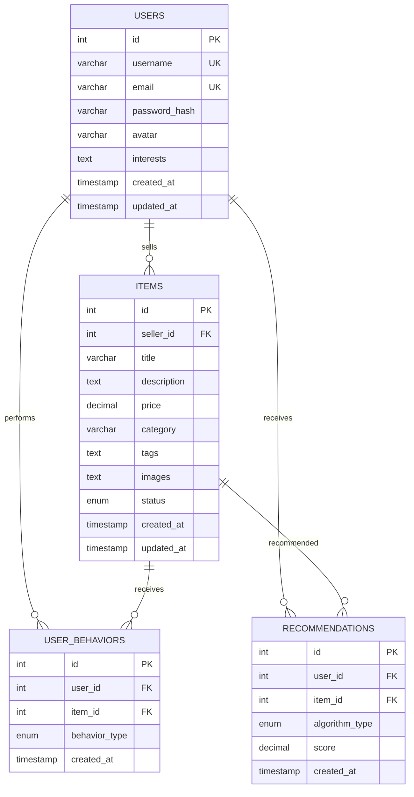
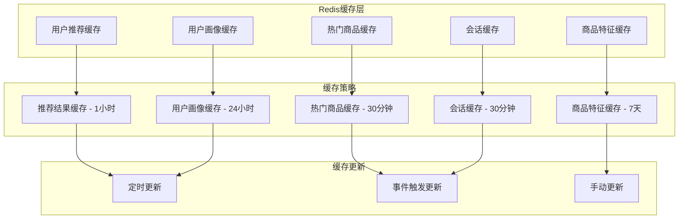
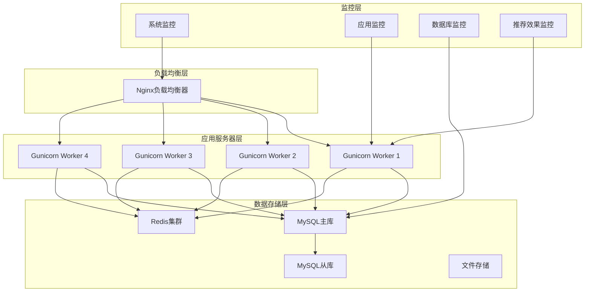
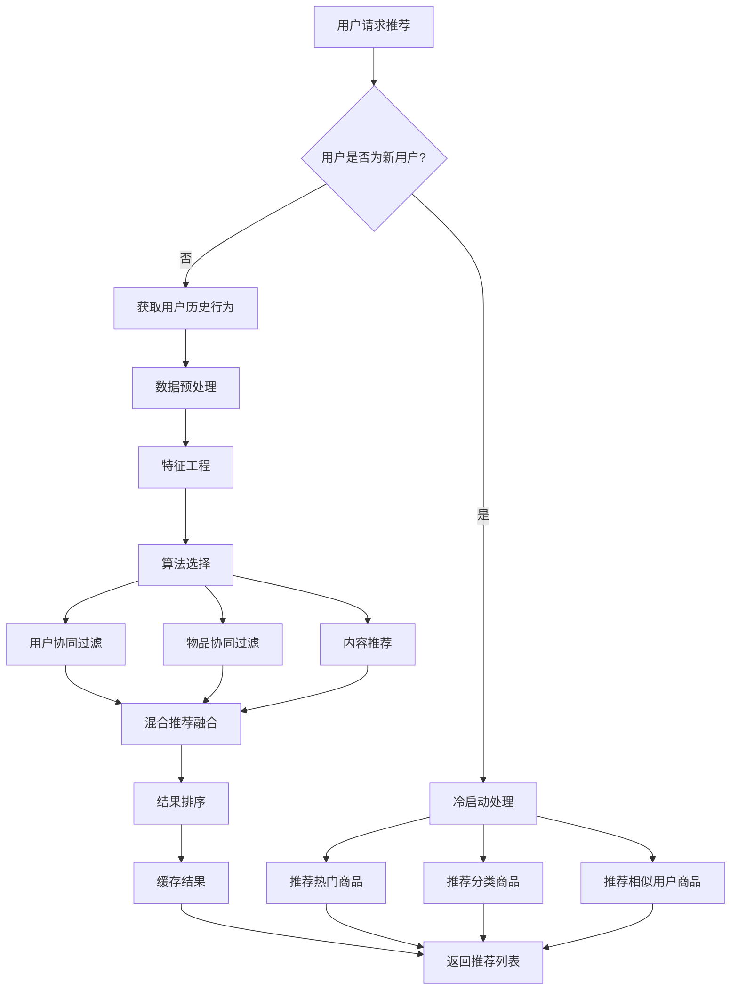
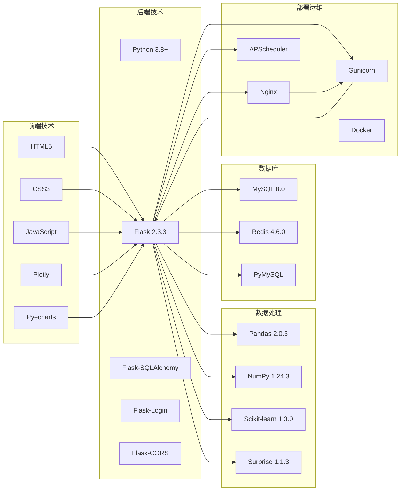

# 校园跳蚤市场智能推荐平台系统架构图

## 系统整体架构

```mermaid
graph TB
    subgraph "前端层 (Frontend Layer)"
        A1[用户界面 - HTML5/CSS3/JS]
        A2[响应式设计]
        A3[数据可视化 - Plotly/Pyecharts]
    end
    
    subgraph "应用层 (Application Layer)"
        B1[Flask Web框架]
        B2[RESTful API接口]
        B3[用户管理模块]
        B4[商品管理模块]
        B5[推荐引擎模块]
        B6[交易管理模块]
    end
    
    subgraph "业务逻辑层 (Business Logic Layer)"
        C1[用户服务]
        C2[商品服务]
        C3[推荐服务]
        C4[交易服务]
        C5[数据分析服务]
    end
    
    subgraph "算法层 (Algorithm Layer)"
        D1[协同过滤算法]
        D2[内容推荐算法]
        D3[混合推荐算法]
        D4[数据预处理]
        D5[特征工程]
    end
    
    subgraph "数据层 (Data Layer)"
        E1[MySQL数据库]
        E2[Redis缓存]
        E3[文件存储]
        E4[日志系统]
    end
    
    subgraph "基础设施层 (Infrastructure Layer)"
        F1[Web服务器 - Nginx]
        F2[应用服务器 - Gunicorn]
        F3[监控系统]
        F4[定时任务 - APScheduler]
    end
    
    A1 --> B1
    A2 --> B1
    A3 --> B1
    B1 --> B2
    B2 --> C1
    B2 --> C2
    B2 --> C3
    B2 --> C4
    B2 --> C5
    C3 --> D1
    C3 --> D2
    C3 --> D3
    D1 --> D4
    D2 --> D4
    D3 --> D4
    D4 --> D5
    C1 --> E1
    C2 --> E1
    C3 --> E2
    C4 --> E1
    C5 --> E1
    B1 --> F1
    F1 --> F2
    F2 --> B1
    F4 --> C3
```

## 推荐系统架构

```mermaid
graph LR
    subgraph "数据输入"
        A1[用户行为数据]
        A2[商品特征数据]
        A3[用户画像数据]
    end
    
    subgraph "数据预处理"
        B1[数据清洗]
        B2[特征提取]
        B3[权重计算]
        B4[时间衰减]
    end
    
    subgraph "推荐算法"
        C1[用户协同过滤]
        C2[物品协同过滤]
        C3[内容推荐]
        C4[混合推荐]
    end
    
    subgraph "推荐引擎"
        D1[算法选择器]
        D2[权重调整器]
        D3[结果融合器]
        D4[冷启动处理器]
    end
    
    subgraph "输出结果"
        E1[推荐商品列表]
        E2[推荐分数]
        E3[推荐理由]
    end
    
    A1 --> B1
    A2 --> B2
    A3 --> B3
    B1 --> C1
    B2 --> C2
    B3 --> C3
    C1 --> D1
    C2 --> D1
    C3 --> D1
    D1 --> D2
    D2 --> D3
    D3 --> D4
    D4 --> E1
    D4 --> E2
    D4 --> E3
```

## 数据库架构

```mermaid
erDiagram
    USERS {
        int id PK
        varchar username UK
        varchar email UK
        varchar password_hash
        varchar avatar
        text interests
        timestamp created_at
        timestamp updated_at
    }
    
    ITEMS {
        int id PK
        int seller_id FK
        varchar title
        text description
        decimal price
        varchar category
        text tags
        text images
        enum status
        timestamp created_at
        timestamp updated_at
    }
    
    USER_BEHAVIORS {
        int id PK
        int user_id FK
        int item_id FK
        enum behavior_type
        timestamp created_at
    }
    
    RECOMMENDATIONS {
        int id PK
        int user_id FK
        int item_id FK
        enum algorithm_type
        decimal score
        timestamp created_at
    }
    
    USERS ||--o{ ITEMS : "sells"
    USERS ||--o{ USER_BEHAVIORS : "performs"
    ITEMS ||--o{ USER_BEHAVIORS : "receives"
    USERS ||--o{ RECOMMENDATIONS : "receives"
    ITEMS ||--o{ RECOMMENDATIONS : "recommended"
```

## 缓存架构

```mermaid
graph TB
    subgraph "Redis缓存层"
        A1[用户推荐缓存]
        A2[热门商品缓存]
        A3[用户画像缓存]
        A4[商品特征缓存]
        A5[会话缓存]
    end
    
    subgraph "缓存策略"
        B1[推荐结果缓存 - 1小时]
        B2[热门商品缓存 - 30分钟]
        B3[用户画像缓存 - 24小时]
        B4[商品特征缓存 - 7天]
        B5[会话缓存 - 30分钟]
    end
    
    subgraph "缓存更新"
        C1[定时更新]
        C2[事件触发更新]
        C3[手动更新]
    end
    
    A1 --> B1
    A2 --> B2
    A3 --> B3
    A4 --> B4
    A5 --> B5
    B1 --> C1
    B2 --> C2
    B3 --> C1
    B4 --> C3
    B5 --> C2
```

## 部署架构

```mermaid
graph TB
    subgraph "负载均衡层"
        A1[Nginx负载均衡器]
    end
    
    subgraph "应用服务器层"
        B1[Gunicorn Worker 1]
        B2[Gunicorn Worker 2]
        B3[Gunicorn Worker 3]
        B4[Gunicorn Worker 4]
    end
    
    subgraph "数据存储层"
        C1[MySQL主库]
        C2[MySQL从库]
        C3[Redis集群]
        C4[文件存储]
    end
    
    subgraph "监控层"
        D1[系统监控]
        D2[应用监控]
        D3[数据库监控]
        D4[推荐效果监控]
    end
    
    A1 --> B1
    A1 --> B2
    A1 --> B3
    A1 --> B4
    B1 --> C1
    B2 --> C1
    B3 --> C1
    B4 --> C1
    B1 --> C3
    B2 --> C3
    B3 --> C3
    B4 --> C3
    C1 --> C2
    D1 --> A1
    D2 --> B1
    D3 --> C1
    D4 --> B1
```

## 算法流程架构

```mermaid
flowchart TD
    A[用户请求推荐] --> B{用户是否为新用户?}
    B -->|是| C[冷启动处理]
    B -->|否| D[获取用户历史行为]
    
    C --> C1[推荐热门商品]
    C --> C2[推荐分类商品]
    C --> C3[推荐相似用户商品]
    
    D --> E[数据预处理]
    E --> F[特征工程]
    F --> G[算法选择]
    
    G --> H1[用户协同过滤]
    G --> H2[物品协同过滤]
    G --> H3[内容推荐]
    
    H1 --> I[混合推荐融合]
    H2 --> I
    H3 --> I
    
    I --> J[结果排序]
    J --> K[缓存结果]
    K --> L[返回推荐列表]
    
    C1 --> L
    C2 --> L
    C3 --> L
```

## 技术栈架构

```mermaid
graph LR
    subgraph "前端技术"
        A1[HTML5]
        A2[CSS3]
        A3[JavaScript]
        A4[Plotly]
        A5[Pyecharts]
    end
    
    subgraph "后端技术"
        B1[Python 3.8+]
        B2[Flask 2.3.3]
        B3[Flask-SQLAlchemy]
        B4[Flask-Login]
        B5[Flask-CORS]
    end
    
    subgraph "数据处理"
        C1[Pandas 2.0.3]
        C2[NumPy 1.24.3]
        C3[Scikit-learn 1.3.0]
        C4[Surprise 1.1.3]
    end
    
    subgraph "数据库"
        D1[MySQL 8.0]
        D2[Redis 4.6.0]
        D3[PyMySQL]
    end
    
    subgraph "部署运维"
        E1[Nginx]
        E2[Gunicorn]
        E3[APScheduler]
        E4[Docker]
    end
    
    A1 --> B2
    A2 --> B2
    A3 --> B2
    A4 --> B2
    A5 --> B2
    B2 --> C1
    B2 --> C2
    B2 --> C3
    B2 --> C4
    B2 --> D1
    B2 --> D2
    B2 --> D3
    B2 --> E1
    B2 --> E2
    B2 --> E3
    E1 --> E2
    E2 --> B2
``` 